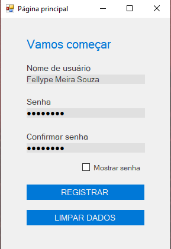
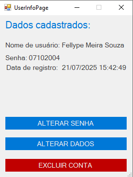
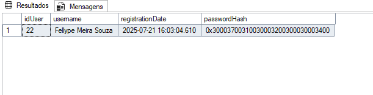

<section>
  <h1>📃 Tela de Cadastro e Login</h1>
  

    Esse projeto consiste eum um pequeno programa feito em C# Windows Forms tendo como principal objetivo o cadastro de usuários. Além disso teve como objetivo
    relembrar alguns conceitos de criação e integração a um Banco de Dados, estudar um pouco mais a respeito do padrão de desenvolvimento MVC e exercitar a lógica de programação.
    Acesse <a href="https://github.com/FellypeSouza/Tela-de-Cadastro-e-Login/" target="_blank">aqui</a>.
  

  <h1>⚙️ Tecnologias utilizadas</h1>
  <ul>
    <li>C#</li>
    <li>Windows Forms</li>
    <li>SQL SERVER</li>
    <li>Padrão MVC</li>
  </ul>
  <h1>🚀 Funcionalidades</h1>
  <ul>
    <li>Cadastro de usuários</li>
    <li>Realizar Login</li>
    <li>Alterar os dados cadastrados incluindo Nome e Senha</li>
    <li>Excluir usuário</li>
    <li>Interface simples</li>
    <li>Integração a um Banco de Dados</li>
  </ul>
  <h1>📷 Prints do projeto</h1>
  <section>
    <h4>Inserção dos dados</h4>
    
     
    <h4>Leitura dos dados</h4>
    
     
    <h4>Dados inseridos no Banco de Dados</h4>
    
  </section>
</section>
